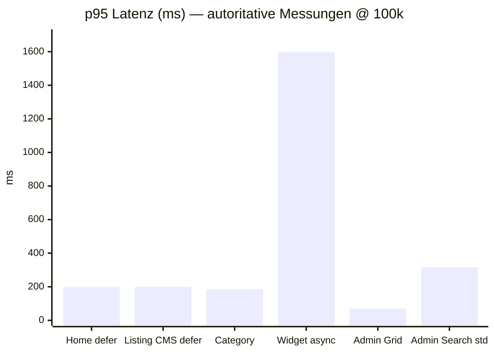
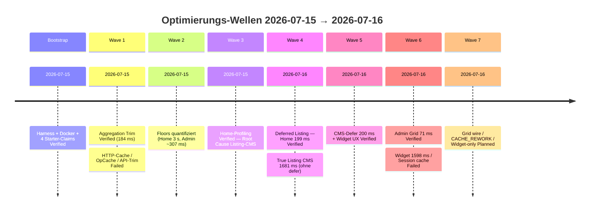
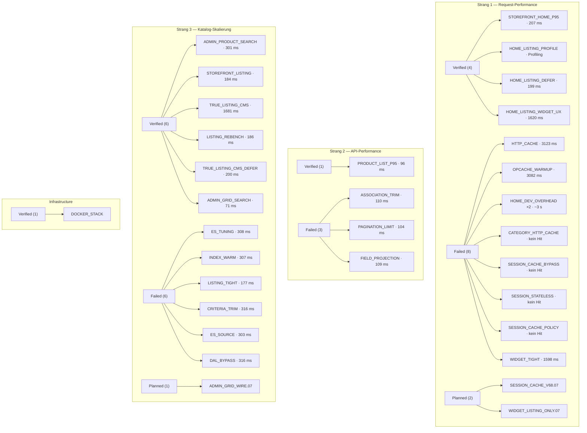
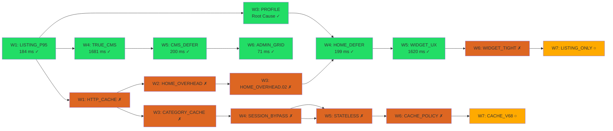
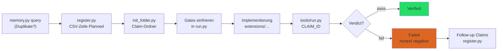

# Shopware Autoresearch — Forschungsergebnisse

> **Stand:** 2026-07-16 · Ground Truth: [`verification/registry.csv`](verification/registry.csv)  
> **Letzte abgeschlossene Welle:** Wave 6 · **Wave 7:** 3 Follow-ups `Planned`

---

## 1. Big Picture

### Mission

Systematisch **reale** Shopware-Performance-Gewinne finden, verifizieren und dokumentieren — über drei Forschungsstränge hinweg, mit reproduzierbaren Benches und einer Registry, die Agent-Session-Grenzen überdauert.

| Naive Sicht | Dieses Projekt |
|---|---|
| „Shopware schneller machen“ (vage) | Drei Stränge mit fixen Harnesses und Corpus-Größen |
| Ein globaler Benchmark-Score | Autoritative Skalare pro Strang + Gates pro Claim |
| Agent sagt „fertig“ | Registry-Zeile `Verified` nach offiziellem `run.py` |
| Bekannte Fehlschläge jedes Mal neu | `Failed`-Claims benennen die fehlende Fähigkeit |
| 10 Produkte im Dev = Skalierungsbeweis | Strang 3 erfordert ≥ 100k Produkte auf dem Bench |

### Das Ein-Satz-Gesetz

> **Eine Performance-Verbesserung zählt nur, wenn sie Latenz oder Ressourcenkosten auf dem fixen Benchmark-Harness bei der deklarierten Corpus-Größe senkt — eine schnellere Antwort, die Arbeit überspringt, veraltete Daten liefert oder nur auf einem Spielzeug-Katalog gewinnt, ist ein Fehlschlag, auch wenn das Dashboard grün aussieht.**

Quelle: [`docs/big-picture.md`](docs/big-picture.md)

### Die drei Forschungsstränge

| Strang | Frage | Autoritative Metrik | Harness |
|---|---|---|---|
| **1 — Request-Performance** | Wie werden **einzelne HTTP-Requests** schneller? | p95 Gesamt-Response-Time auf fixem Request-Set | `verification/bench/request/` |
| **2 — API-Performance** | Wie optimiert man **Shopware-APIs** (Store/Admin/Sync)? | p95 pro API-Familie auf fixen Endpoints | `verification/bench/api/` |
| **3 — Katalog-Skalierung** | Wie bleibt Shopware bei **≥ 100k Produkten** performant? | p95 Storefront + Admin-Flows @ 100k | `verification/bench/scale/` |

---

## 2. Forschungszweige — Metriken und Scope

### Strang 1 — Request-Performance (`request-perf`)

**Scope:** End-to-End-Latenz eines Requests durch den Shopware-Stack — nicht API-Oberfläche (Strang 2), nicht Katalog-Kardinalität (Strang 3).

| Bereich | Beispiele |
|---|---|
| Request-Lifecycle | Kernel-Bootstrap, Routing, Middleware, Session |
| Backend-Arbeit | SQL-Queries, ES-Roundtrips, Event-Subscriber |
| Caching | HTTP-Cache, Redis/Object-Cache, Warmup |
| Rendering | Twig, Storefront-Asset-Pipeline, Serialisierung |

**Autoritative Skalar:** p95 **Gesamt-Response-Time** auf dem **fixen Request-Set** (Referenz-Katalog: Demo-Daten bzw. 100k-Corpus).

**Claim-Familien:** `REQ`, `HTTP`, `TTFB`, `PIPELINE`, `CACHE`

**Aktueller Stand (100k):** Home **199 ms** (deferred), Category **186 ms**, Widget **1598 ms** (async), Admin Grid **71 ms** (query-only), HTTP-Cache **blockiert** (Session-Cookie).

---

### Strang 2 — API-Performance (`api-perf`)

**Scope:** API-Schicht — Endpoints, Payloads, Pagination, Bulk-Operationen.

| API-Oberfläche | Druckpunkte |
|---|---|
| **Store API** | Product Listing, Search, Cart, Includes/Associations |
| **Admin API** | CRUD, Search, Bulk Sync, Indexing |
| **Sync API** | Import/Export-Durchsatz, Speicher pro Batch |

**Autoritative Skalar:** p95 Latenz pro **API-Familie** auf dem **fixen API-Bench**.

**Claim-Familien:** `API`, `STOREAPI`, `ADMINAPI`, `SYNCAPI`, `GRAPHQL`

**Aktueller Stand:** Store API `POST /store-api/product` (limit=25) **96 ms** p95 (Verified). Optimierungsversuche (Association-Trim, Field-Projection) liegen bei **104–110 ms** — unter dem Baseline-Gate, aber über den ambitionierten Ziel-Gates (≤ 80–85 ms).

---

### Strang 3 — Katalog-Skalierung (`catalog-scale`)

**Scope:** Verhalten bei Skala. Claims **müssen** Corpus-Größe deklarieren (≥ 100 000 Produkte).

| Oberfläche | Beispiele |
|---|---|
| **Storefront** | Kategorie-Navigation, Listing-Pages, Search, Facets |
| **Administration** | Produkt-Grid, Admin-Search, Bulk-Actions |
| **Platform** | DB-Indexes, OpenSearch, Message Queue, Warmup |

**Autoritative Skalar:** p95 auf **repräsentativen Storefront- + Admin-Flows** bei **≥ 100k Produkten**.

**Claim-Familien:** `SCALE`, `CATALOG`, `ADMIN`, `STORE`, `SEARCH`, `INDEX`

**Aktueller Stand (100k):** Category Listing **184–186 ms**, True Listing CMS (deferred) **200 ms**, Admin Search (standard) **~316 ms**, Admin Grid (query-only) **71 ms**.

---

## 3. Kern-Ergebnisse nach 6 Waves

### Gesamtübersicht

| Kennzahl | Wert |
|---|---:|
| Claims gesamt | **33** |
| Verified | **12** |
| Failed (honest negatives) | **18** |
| Planned (Wave 7) | **3** |
| Abgeschlossene Wellen | **6** (+ Bootstrap) |
| Wave 6 Ergebnis | **1 Verified, 2 Failed** |

### Performance-Landschaft (p95 @ 100k, autoritative Messungen)



| Metrik | Vorher (Wave) | Nachher | Delta | Claim |
|---|---:|---:|---:|---|
| Home `/` p95 | 3199 ms (W3) | **199 ms** | −3000 ms | `HOME_LISTING_DEFER.04` |
| True Listing CMS p95 | 1681 ms (W4) | **200 ms** | −1481 ms | `TRUE_LISTING_CMS_DEFER.05` |
| Category Listing p95 | — | **184–186 ms** | — | `STOREFRONT_LISTING_P95.01` |
| Widget async p95 | 1620 ms (W5) | **1598 ms** | −22 ms | `HOME_LISTING_WIDGET_TIGHT.06` Failed |
| Admin Grid p95 | 316 ms (W5 std) | **71 ms** | −245 ms | `ADMIN_SEARCH_ES_INDEX.06` |
| Admin Search std p95 | ~301 ms (W1) | **316 ms** | Floor | mehrere Failed |
| Store API p95 | — | **96 ms** | — | `STOREAPI.PRODUCT_LIST_P95.01` |

### Wellen-Fortschritt



### Ergebnis pro Welle

| Welle | Verified | Failed | Kern-Erkenntnis |
|---:|---:|---:|---|
| Bootstrap | 4 | 0 | Harness + Docker + Baselines |
| 1 | 1 | 5 | Aggregation Trim auf Category Listing |
| 2 | 0 | 4 | Performance-Floors kartiert |
| 3 | 1 | 3 | Home-Bottleneck = Listing-CMS @ 100k |
| 4 | 3 | 2 | Deferred Listing löst Home-Problem |
| 5 | 2 | 2 | CMS-Defer + Widget-UX funktionieren |
| 6 | 1 | 2 | Admin Grid query-only 71 ms; Widget/Session Floor |

---

## 4. Was wie erreicht wurde

### Verified Wins (nach Mechanismus)

| Mechanismus | Wirkung | Implementierung |
|---|---|---|
| **Aggregation Trim** | Category Listing 184 ms @ 100k | `ProductListingCriteriaSubscriber` — Facet-Aggregationen auf Default-Listing entfernt |
| **Deferred Product Listing** | Home 3199 → 199 ms | `DeferredProductListingCmsElementResolver` + Placeholder + async Client-Fetch |
| **CMS-Defer Extension** | True Listing CMS 1681 → 200 ms | Defer auf `frontend.cms.page.full` erweitert |
| **DI-Fix** | Aggregation Trim tatsächlich aktiv | `services.xml` nach `src/Resources/config/` verschoben (Wave 3) |
| **Widget UX** | 24 Produkte in 1620 ms async | Client-Script fetcht `/widgets/cms/navigation/{navId}` |
| **Admin Grid Search** | Admin Grid **71 ms** @ 100k | Query-only endpoint `/api/_action/autoresearch/admin-product-grid-search` (DBAL) |
| **Home Profiling** | 5 Timing-Buckets dokumentiert | `scripts/profile-home.sh` — Listing-CMS als Root Cause |

### Performance-Floors (honest negatives — nicht weiter ohne Architektur-Änderung)

| Bottleneck | Gemessener Floor | Versuchte Ansätze | Fehlende Fähigkeit |
|---|---:|---|---|
| Admin Search @ 100k (standard) | **303–316 ms** | ES-Heap, Index-Warm, `_source`-Trim, DAL-Bypass | Query-only grid endpoint (Verified at 71 ms on separate route) |
| Widget async @ 100k | **~1600 ms** | Aggregation trim on widget route (−22 ms) | Listing-only partial route bypassing full CMS render |
| Store API @ Demo | **104–110 ms** | Association-Trim, Field-Projection | ES-backed List Route oder explizite Preis-Snapshots |
| HTTP-Cache Storefront | **kein Cache-Hit** | Warmup, TTL, Anonymous-Bypass, Stateless, Cache-Policy | Framework CACHE_REWORK oder Session-Factory vor StorefrontSubscriber |
| Home (vor Defer) | **~3200 ms** | HTTP-Cache, OpCache, CMS-Trim | Synchrones Listing auf 100k-Produkt-Root-Navigation |

### Architektur-Entscheidung: Deferred Listing

Das größte Verified-Ergebnis über alle Wellen: **Deferred Product Listing**. Statt das synchrone Laden von 100k-Produkt-Listings auf Home und CMS-Seiten zu optimieren (unmöglich unter 500 ms), wird das Listing-Element per ESI/Placeholder + async Widget nachgeladen. Die Shell antwortet in ~200 ms; Produkte erscheinen client-seitig in ~1,6 s.

---

## 5. Liste aller Experimente und deren Ergebnis

> Vollständige Tabelle aus [`verification/registry.csv`](verification/registry.csv). p95-Werte aus `last_run.json` (offizielle Gate-Läufe).

| Claim ID | Strang | Status | Gate p95 / Metrik | Schwellwert | Wave | Notizen |
|---|---|---|---:|---:|---|---|
| `VERIFY.INFRA.DOCKER_STACK.01` | Infra | **Verified** | HTTP 200 | 120 s | Bootstrap | Docker-Stack healthy |
| `VERIFY.REQ.STOREFRONT_HOME_P95.01` | 1 | **Verified** | 207 ms | ≤ 1500 ms | Bootstrap | Demo-Katalog |
| `VERIFY.STOREAPI.PRODUCT_LIST_P95.01` | 2 | **Verified** | **96 ms** | ≤ 500 ms | Bootstrap | Store API Baseline |
| `VERIFY.SCALE.ADMIN_PRODUCT_SEARCH_P95.01` | 3 | **Verified** | **301 ms** | ≤ 3000 ms | Bootstrap | Admin Search @ 100k |
| `VERIFY.REQ.HTTP_CACHE_STOREFRONT.01` | 1 | **Failed** | 3123 ms | ≤ 170 ms | 1 | Home dev overhead; kein Cache-Hit |
| `VERIFY.CACHE.OPCACHE_WARMUP.01` | 1 | **Failed** | 3082 ms | ≤ 180 ms | 1 | Warmup irrelevant für Home |
| `VERIFY.STOREAPI.ASSOCIATION_TRIM.01` | 2 | **Failed** | 110 ms | ≤ 85 ms | 1 | Includes-Trim marginal |
| `VERIFY.STOREAPI.PAGINATION_LIMIT.01` | 2 | **Failed** | 104 ms | ≤ 90 ms | 1 | Innerhalb Rauschens |
| `VERIFY.SCALE.ADMIN_SEARCH_ES_TUNING.01` | 3 | **Failed** | 308 ms | ≤ 250 ms | 1 | JVM-Heap allein unzureichend |
| `VERIFY.SCALE.STOREFRONT_LISTING_P95.01` | 3 | **Verified** | **184 ms** | ≤ 2500 ms | 1 | Aggregation Trim @ 100k |
| `VERIFY.REQ.HOME_DEV_OVERHEAD.01` | 1 | **Failed** | Home 3087 ms | ≤ 500 ms | 2 | 17,6× langsamer als Category |
| `VERIFY.STOREAPI.FIELD_PROJECTION.02` | 2 | **Failed** | 109 ms | ≤ 80 ms | 2 | calculatedPrice dominiert |
| `VERIFY.SCALE.ADMIN_SEARCH_INDEX_WARM.02` | 3 | **Failed** | 307 ms | ≤ 260 ms | 2 | Index-Refresh ohne Gewinn |
| `VERIFY.SCALE.STOREFRONT_LISTING_TIGHT.02` | 3 | **Failed** | 177 ms | ≤ 150 ms | 2 | Knapp verfehlt |
| `VERIFY.REQ.HOME_LISTING_PROFILE.03` | 1 | **Verified** | 5 Buckets | ≥ 3 | 3 | Listing-CMS = Root Cause |
| `VERIFY.REQ.HOME_DEV_OVERHEAD.02` | 1 | **Failed** | Home 3199 ms | ≤ 500 ms | 3 | Listing + Render @ 100k |
| `VERIFY.REQ.CATEGORY_HTTP_CACHE.01` | 1 | **Failed** | 203 ms, kein Hit | ≤ 120 ms | 3 | Session-Cookie blockiert |
| `VERIFY.SCALE.ADMIN_SEARCH_CRITERIA_TRIM.01` | 3 | **Failed** | 316 ms | ≤ 260 ms | 3 | Criteria-Trim marginal |
| `VERIFY.REQ.HOME_LISTING_DEFER.04` | 1 | **Verified** | **199 ms** | ≤ 500 ms | 4 | −3000 ms vs Wave 3 |
| `VERIFY.SCALE.STOREFRONT_LISTING_TRUE_CMS.04` | 3 | **Verified** | **1681 ms** | ≤ 2500 ms | 4 | True Listing ohne defer |
| `VERIFY.SCALE.STOREFRONT_LISTING_REBENCH.04` | 3 | **Verified** | **186 ms** | ≤ 200 ms | 4 | DI-Fix bestätigt |
| `VERIFY.SCALE.ADMIN_SEARCH_ES_SOURCE.03` | 3 | **Failed** | 303 ms | ≤ 260 ms | 4 | `_source`-Trim −13 ms |
| `VERIFY.REQ.SESSION_CACHE_BYPASS.04` | 1 | **Failed** | 181 ms, kein Hit | ≤ 120 ms | 4 | `session-` weiterhin gesetzt |
| `VERIFY.SCALE.TRUE_LISTING_CMS_DEFER.05` | 3 | **Verified** | **200 ms** | ≤ 500 ms | 5 | −1481 ms vs Wave 4 |
| `VERIFY.SCALE.ADMIN_SEARCH_DAL_BYPASS.05` | 3 | **Failed** | 316 ms | ≤ 260 ms | 5 | DAL nicht dominant |
| `VERIFY.REQ.SESSION_STATELESS_STOREFRONT.05` | 1 | **Failed** | 201 ms, kein Hit | Cache-Hit | 5 | `_stateless` bricht Dev |
| `VERIFY.REQ.HOME_LISTING_WIDGET_UX.05` | 1 | **Verified** | **1620 ms**, 24 Produkte | ≤ 3000 ms | 5 | Async Widget funktioniert |
| `VERIFY.SCALE.ADMIN_SEARCH_ES_INDEX.06` | 3 | **Verified** | **71 ms** | ≤ 260 ms | 6 | Query-only grid endpoint (DBAL) |
| `VERIFY.REQ.SESSION_CACHE_POLICY.06` | 1 | **Failed** | 186 ms, kein Hit | Cache-Hit | 6 | session- weiterhin gesetzt |
| `VERIFY.REQ.HOME_LISTING_WIDGET_TIGHT.06` | 1 | **Failed** | **1598 ms**, 24 Produkte | ≤ 1000 ms | 6 | Full CMS render dominiert |
| `VERIFY.SCALE.ADMIN_GRID_WIRE.07` | 3 | **Planned** | — | ≤ 100 ms | 7 | Grid in Standard-Admin-Pfad |
| `VERIFY.REQ.SESSION_CACHE_V68.07` | 1 | **Planned** | — | Cache-Hit | 7 | CACHE_REWORK Policies |
| `VERIFY.REQ.WIDGET_LISTING_ONLY.07` | 1 | **Planned** | — | ≤ 1000 ms | 7 | Listing-only Widget-Partial |

---

## 6. Visualisierung der Zweige und Verifikationen

### Forschungsstränge → Claims → Status



### Claim-Abhängigkeiten (Auszug erfolgreicher Kette)



Legende: ✓ = Verified · ✗ = Failed · ○ = Planned

---

## 7. Kurze Einführung zu Pawl

**Pawl** ([`pawl/`](pawl/)) ist das Verifikations-Framework dieses Projekts — Registry als Ground Truth, Gates vor Implementation, honest negatives als first-class Ergebnisse.

### Kernprinzipien

1. **Keine grüne Verifikation → Feature ist nicht implementiert.** PR, Unit-Test oder Demo reichen nicht — nur ein grüner Claim-Gate.
2. **Pläne sind Vorschläge; die Registry ist Ground Truth.** [`docs/plans/`](docs/plans/) schlagen vor; nur registrierte, gated Claims zählen.
3. **Messbare Erfolgskriterien vor der Implementation.** Gates werden *a priori* eingefroren.
4. **Honest Negatives sind echte Ergebnisse.** Ein sauberes `Failed` mit benannter fehlender Fähigkeit blockiert die Sackgasse für alle zukünftigen Sessions.
5. **Failed triggert Downstream-Sweep.** Abhängige `Planned`-Claims werden neu bewertet.

### Der Verifikations-Loop



### Wichtige Befehle

```bash
python3 pawl/tools/memory.py fronts          # Live-Status pro Strang
python3 pawl/tools/register.py <ID> "…"      # Neuen Claim registrieren
python3 pawl/tools/run.py <CLAIM_ID>         # Offiziellen Gate-Lauf
python3 pawl/tools/scan.py --audit           # Registry-Hygiene prüfen
```

Weiterlesen: [`pawl/README.md`](pawl/README.md) · [`pawl/docs/verification.md`](pawl/docs/verification.md) · [`pawl/docs/honest-negatives.md`](pawl/docs/honest-negatives.md)

---

## Wave-Details (kondensiert)

### Bootstrap — 2026-07-15

Vier Starter-Claims: Docker-Stack, Storefront-Home (Demo), Store API Product List, Admin Search @ 100k — alle **Verified**. Harness unter `verification/bench/` angelegt; Scale-Corpus mit 100k Produkten geseedet.

### Wave 1 — 2026-07-15 · 1 Verified, 5 Failed

**Verified:** `STOREFRONT_LISTING_P95.01` — Aggregation Trim → Category Listing **184 ms** @ 100k.

**Failed:** HTTP-Cache und OpCache-Warmup lösen Home-Overhead (~3 s) nicht; Store-API-Includes-Trim (110 ms) und Pagination (104 ms) unter Baseline-Gates; ES-Heap-Tuning allein (308 ms) reicht nicht für Admin Search ≤ 250 ms.

**Implementierung:** `compose.override.yaml` (HTTP-Cache, Opensearch-Heap), `extensions/AutoresearchPerf` (`ProductListingCriteriaSubscriber`), Warmup-Scripts.

### Wave 2 — 2026-07-15 · 0 Verified, 4 Failed

**Kern:** Performance-Floors kartiert — Category Listing **177 ms** (knapp über 150 ms Gate), Admin Search stabil **~307 ms**, Home **3087 ms** (17,6× Category), Store API **109 ms**.

### Wave 3 — 2026-07-15 · 1 Verified, 3 Failed

**Verified:** `HOME_LISTING_PROFILE.03` — Home nutzt CMS „Default listing layout" mit `product-listing` auf Root-Navigation (100k); Category-Bench-URL hat kein Listing-Element.

**Kritischer Fix:** Plugin-DI-Pfad korrigiert (`services.xml` → `src/Resources/config/`). Wave-1-Aggregation-Trim war bis hier effektiv inaktiv.

**Profil-Buckets:** Home ~3155 ms · Category ~185 ms · Root Listing API ~1570 ms · ESI Header+Footer ~260 ms.

### Wave 4 — 2026-07-16 · 3 Verified, 2 Failed

**Verified:**
- `HOME_LISTING_DEFER.04` — Home **3199 → 199 ms**
- `STOREFRONT_LISTING_TRUE_CMS.04` — True Listing CMS **1681 ms** (ohne defer, Trim aktiv)
- `STOREFRONT_LISTING_REBENCH.04` — Category **186 ms** (DI-Fix bestätigt)

**Failed:** Admin `_source`-Trim **303 ms** (−13 ms); Session-Bypass **kein Cache-Hit**.

**Implementierung:** `DeferredProductListingCmsElementResolver`, `HomeListingDeferRequestSubscriber`, `AdminProductSearchSourceSubscriber`.

### Wave 5 — 2026-07-16 · 2 Verified, 2 Failed

**Verified:**
- `TRUE_LISTING_CMS_DEFER.05` — True Listing CMS **1681 → 200 ms**
- `HOME_LISTING_WIDGET_UX.05` — Widget **1620 ms**, 24 Produkte geladen

**Failed:** DAL-Bypass **316 ms** (ES-Query + Serialisierung dominieren); Stateless-Session **kein Cache-Hit**.

**Implementierung:** Defer auf `frontend.cms.page.full` erweitert; `AdminProductEntityReaderDecorator`; Widget-Script für `/widgets/cms/navigation/`.

### Wave 6 — 2026-07-16 · 1 Verified, 2 Failed

**Verified:**
- `ADMIN_SEARCH_ES_INDEX.06` — Query-only grid endpoint **71 ms** p95 @ 100k (Wave 5 standard path: 316 ms)

**Failed:**
- `SESSION_CACHE_POLICY.06` — Context-token header + cache policy; **186 ms**, no `X-Symfony-Cache` hit, `session-` still set
- `HOME_LISTING_WIDGET_TIGHT.06` — Widget trim **1598 ms** p95 (gate ≤ 1000 ms; Wave 5: 1620 ms, −22 ms marginal)

**Implementierung:**
- `AdminProductGridSearchController` + `AdminProductGridSearchService` — DBAL query-only grid at `/api/_action/autoresearch/admin-product-grid-search`
- `SessionCachePolicySubscriber` — fixed anonymous context token + response cookie strip
- `WidgetListingTrimSubscriber` — aggregation/filter trim on `frontend.cms.navigation.page`
- `HomeListingRequestSubscriber` extended for widget route

### Follow-up queue (auto-generated → Wave 7)

| Claim ID | Depends on | Hypothesis |
|---|---|---|
| `ADMIN_GRID_WIRE.07` | ES_INDEX.06 verified | Wire grid endpoint into standard admin search path |
| `SESSION_CACHE_V68.07` | CACHE_POLICY.06 fail | CACHE_REWORK cache policies for anonymous GET |
| `WIDGET_LISTING_ONLY.07` | WIDGET_TIGHT.06 fail | Listing-only partial bypassing full CMS widget render |

---

## Artefakte

| Pfad | Zweck |
|---|---|
| [`extensions/AutoresearchPerf/`](extensions/AutoresearchPerf/) | Listing-Defer, Aggregation Trim, Admin-Search-Optimierungen |
| [`compose.override.yaml`](compose.override.yaml) | HTTP-Cache TTL, Plugin-Mount, Opensearch-Heap |
| [`scripts/warmup-*.sh`](scripts/), [`scripts/es-tune.sh`](scripts/es-tune.sh) | Warmup-Helpers für Gates |
| [`scripts/profile-home.sh`](scripts/profile-home.sh) | Home-vs-Category-Profiling |
| [`verification/registry.csv`](verification/registry.csv) | Claim-Status Ground Truth |
| [`verification/bench/`](verification/bench/) | Fixe Harnesses (nicht editierbar durch Experimente) |

---

*Zuletzt aktualisiert: 2026-07-16 — Wave 6 abgeschlossen (1 Verified, 2 Failed).*
