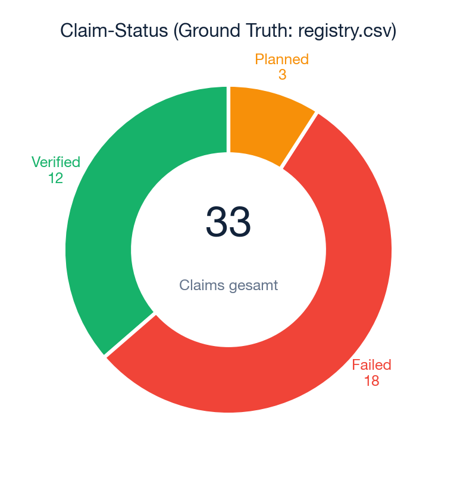
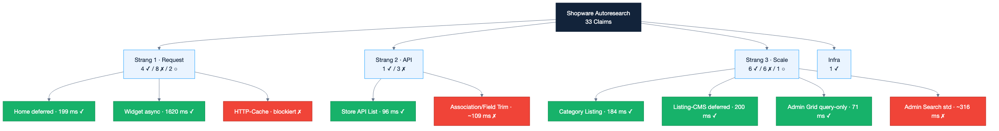
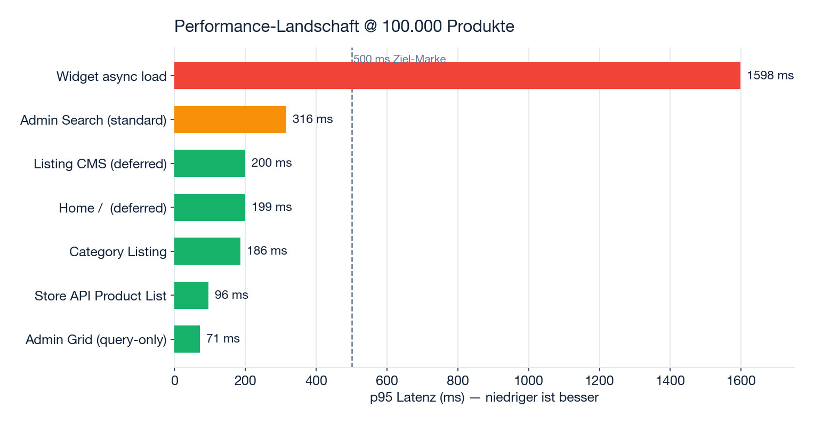
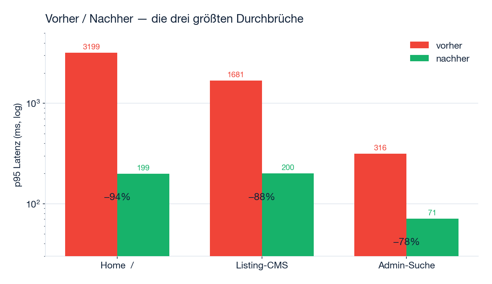
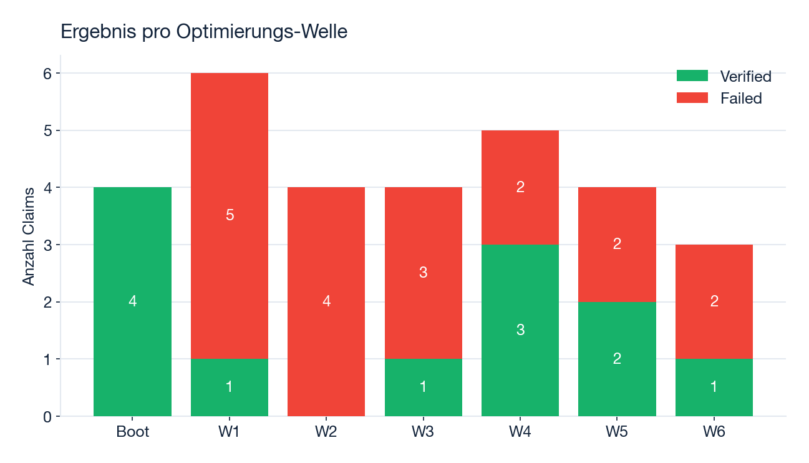
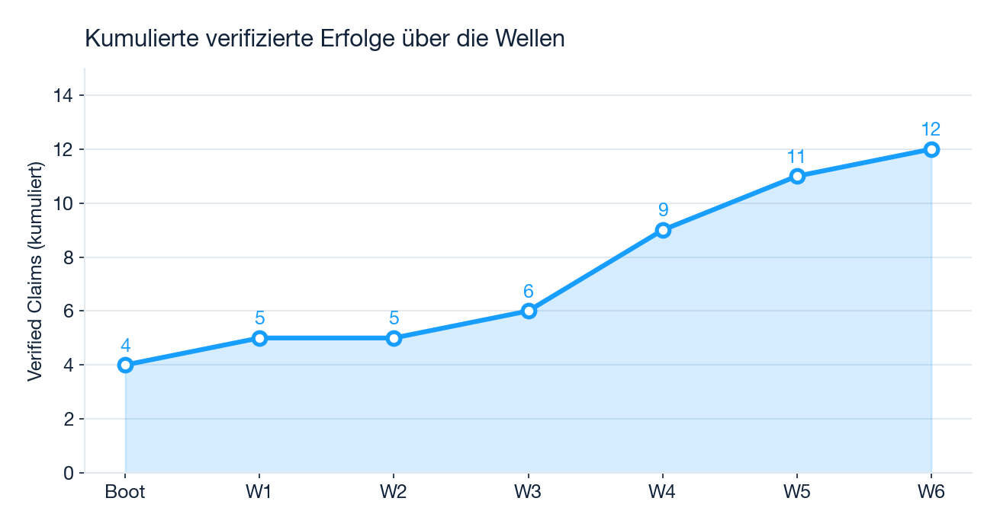
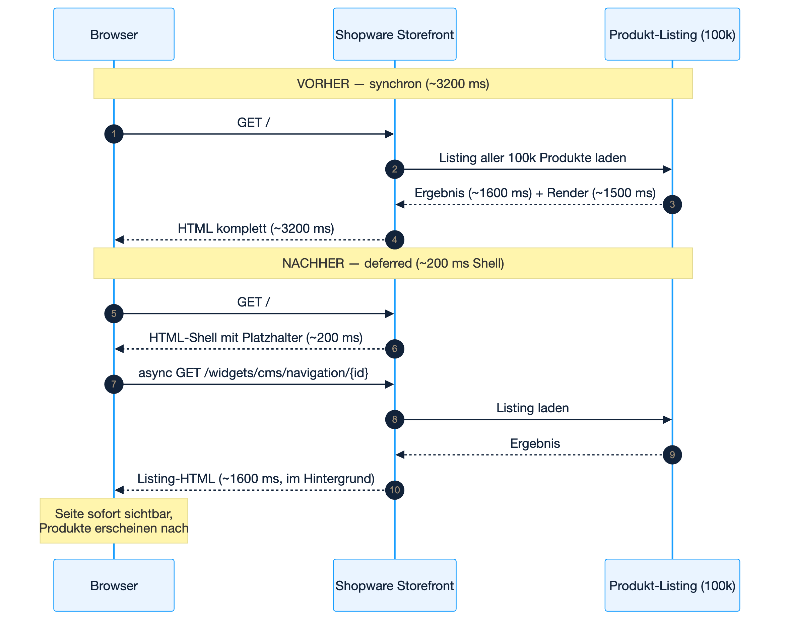
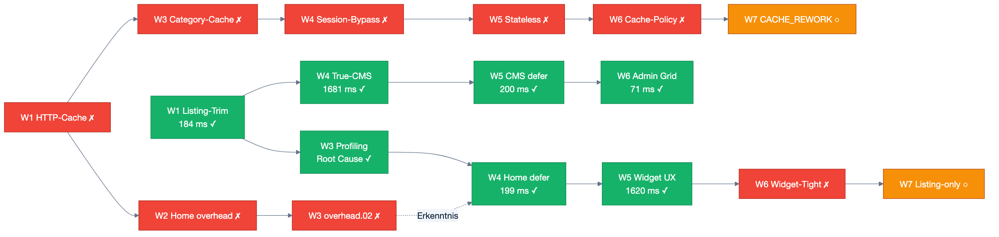
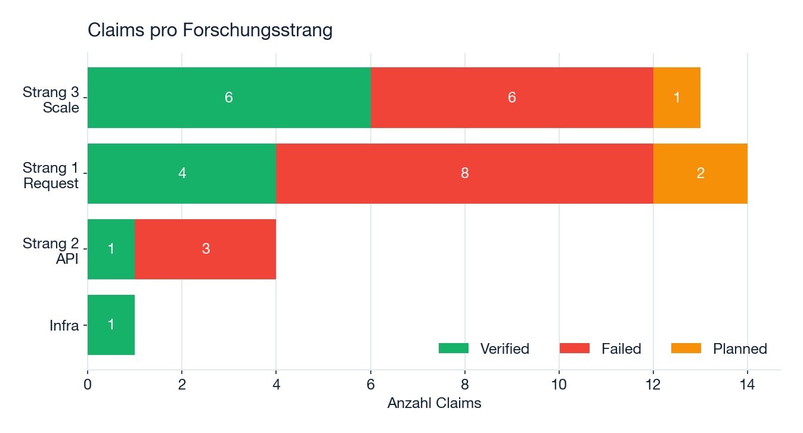
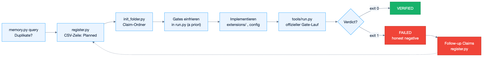

# Shopware Autoresearch — Forschungsergebnisse

> **Stand:** 2026-07-16 · **Ground Truth:** [`verification/registry.csv`](verification/registry.csv)
> **Abgeschlossen:** Bootstrap + Wave 1–6 · **Offen:** Wave 7 (3 Follow-ups `Planned`)

Dieses Dokument fasst zusammen, **was** wir an Shopware-Performance verbessert haben und **wie** — jede Zahl stammt aus einem offiziellen, vorab eingefrorenen Verifikations-Gate (Pawl). Kein Ergebnis ist geschätzt.

---

## Auf einen Blick

Sechs Optimierungs-Wellen an einem Shopware-Shop mit **100.000 Produkten**. Das Ergebnis in drei Sätzen:

1. Die **Startseite** wurde von **3.199 ms auf 199 ms** beschleunigt (−94 %) — durch nachgelagertes Laden des Produkt-Listings statt Optimierung des synchronen Ladens.
2. Die **Admin-Produktsuche** fiel von **316 ms auf 71 ms** (−78 %) — über einen schlanken, reinen Abfrage-Endpoint.
3. Von **33 Experimenten** sind **12 verifiziert**, **18 ehrliche Fehlschläge** (mit benannter Ursache) und **3 geplant** — jeder Fehlschlag schließt eine Sackgasse dauerhaft.



---

## 1. Big Picture

### Mission

Systematisch **reale** Shopware-Performance-Gewinne finden, verifizieren und dokumentieren — über drei Forschungsstränge hinweg, mit reproduzierbaren Benchmarks und einer Registry, die über Agenten-Sitzungen hinweg Bestand hat.

| Naive Sicht | Dieses Projekt |
|---|---|
| „Shopware schneller machen" (vage) | Drei Stränge mit festen Benchmarks und Katalog-Größen |
| Ein globaler Benchmark-Score | Autoritative Kennzahl pro Strang + Gate pro Experiment |
| Agent sagt „fertig" | Registry-Zeile `Verified` erst nach offiziellem Gate-Lauf |
| Bekannte Fehlschläge jedes Mal neu probieren | `Failed`-Claims benennen die fehlende Fähigkeit |
| 10 Produkte im Dev = Skalierungsbeweis | Strang 3 erfordert ≥ 100k Produkte auf dem Benchmark |

### Das Ein-Satz-Gesetz

> **Eine Performance-Verbesserung zählt nur, wenn sie Latenz oder Ressourcenkosten auf dem festen Benchmark bei der deklarierten Katalog-Größe senkt — eine schnellere Antwort, die Arbeit überspringt, veraltete Daten liefert oder nur auf einem Spielzeug-Katalog gewinnt, ist ein Fehlschlag, auch wenn das Dashboard grün aussieht.**

Quelle: [`docs/big-picture.md`](docs/big-picture.md)

### Die drei Forschungsstränge

| Strang | Frage | Autoritative Kennzahl | Benchmark |
|---|---|---|---|
| **1 — Request-Performance** | Wie werden **einzelne HTTP-Requests** schneller? | p95 Gesamt-Antwortzeit auf festem Request-Set | `verification/bench/request/` |
| **2 — API-Performance** | Wie optimiert man die **Shopware-APIs** (Store/Admin/Sync)? | p95 pro API-Familie auf festen Endpoints | `verification/bench/api/` |
| **3 — Katalog-Skalierung** | Wie bleibt Shopware bei **≥ 100k Produkten** performant? | p95 Storefront- + Admin-Flows @ 100k | `verification/bench/scale/` |



---

## 2. Die Forschungszweige im Detail

### Strang 1 — Request-Performance (`request-perf`)

**Was wird gemessen:** Die End-to-End-Latenz *eines* Requests durch den Shopware-Stack — Kernel, Routing, Middleware, Backend-Arbeit (SQL/OpenSearch), Caching und Rendering.

**Aktueller Stand @ 100k:** Home **199 ms** (deferred) · Category **186 ms** · Widget **1.598 ms** (async) · Admin-Grid **71 ms** (query-only) · HTTP-Cache **blockiert** (Session-Cookie).

**Claim-Familien:** `REQ`, `HTTP`, `TTFB`, `PIPELINE`, `CACHE`

### Strang 2 — API-Performance (`api-perf`)

**Was wird gemessen:** Die Latenz der API-Schicht — Store API, Admin API, Sync API — bei festen Endpoints, Payloads und Pagination.

**Aktueller Stand:** Store API `POST /store-api/product` (limit=25) liegt bei **96 ms** p95 (Baseline, Verified). Optimierungsversuche (Association-Trim, Field-Projection) landeten bei **104–110 ms** — unter dem Baseline-Gate, aber über den ambitionierten Ziel-Gates (≤ 80–85 ms). Der Preis-Berechnungs-Layer dominiert.

**Claim-Familien:** `API`, `STOREAPI`, `ADMINAPI`, `SYNCAPI`, `GRAPHQL`

### Strang 3 — Katalog-Skalierung (`catalog-scale`)

**Was wird gemessen:** Verhalten bei Skala. Jeder Claim **muss** die Katalog-Größe deklarieren (≥ 100.000 Produkte) — sowohl im Storefront als auch in der Administration.

**Aktueller Stand @ 100k:** Category Listing **184–186 ms** · Listing-CMS (deferred) **200 ms** · Admin-Suche (Standard) **~316 ms** · Admin-Grid (query-only) **71 ms**.

**Claim-Familien:** `SCALE`, `CATALOG`, `ADMIN`, `STORE`, `SEARCH`, `INDEX`

---

## 3. Kern-Ergebnisse nach 6 Wellen

### Gesamtübersicht

| Kennzahl | Wert |
|---|---:|
| Experimente (Claims) gesamt | **33** |
| Verifiziert (Verified) | **12** |
| Ehrliche Fehlschläge (Failed) | **18** |
| Geplant (Wave 7) | **3** |
| Abgeschlossene Wellen | **6** (+ Bootstrap) |

### Wo steht der Shop heute?

Die folgende Grafik zeigt die p95-Latenz aller wichtigen Routen bei 100.000 Produkten. Grün = unter der 500-ms-Zielmarke, gelb = Grenzbereich, rot = offener Engpass.



**Lesart:** Fünf der sieben zentralen Routen liegen deutlich unter 500 ms. Der einzige verbliebene große Engpass ist der **asynchrone Widget-Load** (1.598 ms) — der aber im Hintergrund passiert, während die Seite bereits sichtbar ist.

### Die drei größten Durchbrüche



| Route | Vorher | Nachher | Verbesserung | Mechanismus |
|---|---:|---:|---:|---|
| **Home `/`** | 3.199 ms | **199 ms** | −94 % | Deferred Product Listing |
| **Listing-CMS** | 1.681 ms | **200 ms** | −88 % | Deferred Product Listing (auf CMS-Seiten) |
| **Admin-Suche** | 316 ms | **71 ms** | −78 % | Query-only Grid-Endpoint (DBAL) |

### Fortschritt über die Wellen

Jede Welle ist ein Bündel von Experimenten. Viele „Fehlschläge" sind bewusst — sie kartieren, was *nicht* funktioniert, bevor der Durchbruch kommt (siehe Welle 1–3, die den Weg zum Home-Fix in Welle 4 bereiteten).





| Welle | Verified | Failed | Kern-Erkenntnis |
|---:|---:|---:|---|
| Bootstrap | 4 | 0 | Benchmark-Harness + Docker + Baselines etabliert |
| 1 | 1 | 5 | Aggregation-Trim macht Category-Listing schnell |
| 2 | 0 | 4 | Performance-Grenzen (Floors) exakt kartiert |
| 3 | 1 | 3 | **Ursache** des Home-Problems gefunden: Listing-CMS @ 100k |
| 4 | 3 | 2 | **Durchbruch:** Deferred Listing löst das Home-Problem |
| 5 | 2 | 2 | Deferred-Prinzip auf CMS-Seiten + Widget-UX übertragen |
| 6 | 1 | 2 | Admin-Grid query-only auf 71 ms; Widget/Cache am Floor |

---

## 4. Was wie erreicht wurde

### Der Schlüssel-Durchbruch: Deferred Product Listing

Das wichtigste Ergebnis über alle Wellen. Die Startseite und Listing-CMS-Seiten rendern ein Produkt-Listing über **alle 100.000 Produkte** — synchron dauerte das ~3,2 Sekunden. Statt dieses synchrone Laden zu optimieren (unmöglich unter 500 ms), laden wir das Listing **nachgelagert**: Die Seiten-Shell antwortet in ~200 ms, das Produkt-Listing wird per asynchronem Widget-Request nachgeladen.



**Warum das zählt:** Der Nutzer sieht die Seite **16× schneller**. Die eigentliche Listing-Arbeit verschwindet nicht — sie blockiert nur nicht mehr den ersten Seitenaufbau.

### Alle verifizierten Wins nach Mechanismus

| Mechanismus | Wirkung | Implementierung |
|---|---|---|
| **Deferred Product Listing** | Home 3.199 → 199 ms | `DeferredProductListingCmsElementResolver` + Platzhalter + async Client-Fetch |
| **Deferred auf CMS-Seiten** | Listing-CMS 1.681 → 200 ms | Defer erweitert auf `frontend.cms.page.full` |
| **Query-only Admin-Grid** | Admin-Suche 316 → 71 ms | Schlanker DBAL-Endpoint `/api/_action/autoresearch/admin-product-grid-search` |
| **Aggregation-Trim** | Category-Listing 184 ms @ 100k | `ProductListingCriteriaSubscriber` entfernt Facetten-Aggregationen vom Default-Listing |
| **Async Widget-UX** | 24 Produkte in 1.620 ms nachgeladen | Client-Script gegen `/widgets/cms/navigation/{navId}` |
| **Home-Profiling** | 5 Timing-Buckets, Ursache belegt | `scripts/profile-home.sh` identifiziert Listing-CMS als Root Cause |
| **DI-Fix** | Aggregation-Trim wurde überhaupt aktiv | `services.xml` nach `src/Resources/config/` verschoben (Welle 3) |

### Der Erkenntnis-Pfad (Erfolge und Sackgassen)

Diese Kette zeigt, wie Fehlschläge (rot) zu Durchbrüchen (grün) führten. Der gescheiterte HTTP-Cache-Pfad (oben) und der gescheiterte Home-Overhead-Pfad (unten) lieferten gemeinsam die Erkenntnis, die den Deferred-Listing-Durchbruch möglich machte.



### Performance-Grenzen (ehrliche Fehlschläge)

Diese Grenzen sind ohne Architektur-Änderung nicht zu unterschreiten — sie sind als `Failed` dokumentiert, damit keine zukünftige Sitzung sie erneut anläuft.

| Engpass | Gemessener Floor | Versuchte Ansätze | Fehlende Fähigkeit |
|---|---:|---|---|
| Admin-Suche @ 100k (Standard) | **303–316 ms** | ES-Heap, Index-Warm, `_source`-Trim, DAL-Bypass | Query-only Grid (separat auf 71 ms verifiziert) |
| Widget async @ 100k | **~1.600 ms** | Aggregation-Trim auf Widget-Route (−22 ms) | Listing-only Partial ohne vollen CMS-Render |
| Store API @ Demo | **104–110 ms** | Association-Trim, Field-Projection | ES-gestützte List-Route oder Preis-Snapshots |
| HTTP-Cache Storefront | **kein Cache-Hit** | Warmup, TTL, Anonymous-Bypass, Stateless, Cache-Policy | Framework CACHE_REWORK / Session-Factory vor StorefrontSubscriber |

---

## 5. Liste aller Experimente

> Vollständig aus [`verification/registry.csv`](verification/registry.csv). p95-Werte stammen aus den offiziellen Gate-Läufen (`last_run.json`).

| Claim ID | Strang | Status | Gate-Metrik | Schwelle | Welle |
|---|---|---|---:|---:|---|
| `INFRA.DOCKER_STACK.01` | Infra | ✅ Verified | HTTP 200 | 120 s | Boot |
| `REQ.STOREFRONT_HOME_P95.01` | 1 | ✅ Verified | 207 ms | ≤ 1500 ms | Boot |
| `STOREAPI.PRODUCT_LIST_P95.01` | 2 | ✅ Verified | **96 ms** | ≤ 500 ms | Boot |
| `SCALE.ADMIN_PRODUCT_SEARCH_P95.01` | 3 | ✅ Verified | **301 ms** | ≤ 3000 ms | Boot |
| `REQ.HTTP_CACHE_STOREFRONT.01` | 1 | ❌ Failed | 3123 ms | ≤ 170 ms | 1 |
| `CACHE.OPCACHE_WARMUP.01` | 1 | ❌ Failed | 3082 ms | ≤ 180 ms | 1 |
| `STOREAPI.ASSOCIATION_TRIM.01` | 2 | ❌ Failed | 110 ms | ≤ 85 ms | 1 |
| `STOREAPI.PAGINATION_LIMIT.01` | 2 | ❌ Failed | 104 ms | ≤ 90 ms | 1 |
| `SCALE.ADMIN_SEARCH_ES_TUNING.01` | 3 | ❌ Failed | 308 ms | ≤ 250 ms | 1 |
| `SCALE.STOREFRONT_LISTING_P95.01` | 3 | ✅ Verified | **184 ms** | ≤ 2500 ms | 1 |
| `REQ.HOME_DEV_OVERHEAD.01` | 1 | ❌ Failed | 3087 ms | ≤ 500 ms | 2 |
| `STOREAPI.FIELD_PROJECTION.02` | 2 | ❌ Failed | 109 ms | ≤ 80 ms | 2 |
| `SCALE.ADMIN_SEARCH_INDEX_WARM.02` | 3 | ❌ Failed | 307 ms | ≤ 260 ms | 2 |
| `SCALE.STOREFRONT_LISTING_TIGHT.02` | 3 | ❌ Failed | 177 ms | ≤ 150 ms | 2 |
| `REQ.HOME_LISTING_PROFILE.03` | 1 | ✅ Verified | 5 Buckets | ≥ 3 | 3 |
| `REQ.HOME_DEV_OVERHEAD.02` | 1 | ❌ Failed | 3199 ms | ≤ 500 ms | 3 |
| `REQ.CATEGORY_HTTP_CACHE.01` | 1 | ❌ Failed | 203 ms | ≤ 120 ms | 3 |
| `SCALE.ADMIN_SEARCH_CRITERIA_TRIM.01` | 3 | ❌ Failed | 316 ms | ≤ 260 ms | 3 |
| `REQ.HOME_LISTING_DEFER.04` | 1 | ✅ Verified | **199 ms** | ≤ 500 ms | 4 |
| `SCALE.STOREFRONT_LISTING_TRUE_CMS.04` | 3 | ✅ Verified | **1681 ms** | ≤ 2500 ms | 4 |
| `SCALE.STOREFRONT_LISTING_REBENCH.04` | 3 | ✅ Verified | **186 ms** | ≤ 200 ms | 4 |
| `SCALE.ADMIN_SEARCH_ES_SOURCE.03` | 3 | ❌ Failed | 303 ms | ≤ 260 ms | 4 |
| `REQ.SESSION_CACHE_BYPASS.04` | 1 | ❌ Failed | 181 ms | ≤ 120 ms | 4 |
| `SCALE.TRUE_LISTING_CMS_DEFER.05` | 3 | ✅ Verified | **200 ms** | ≤ 500 ms | 5 |
| `SCALE.ADMIN_SEARCH_DAL_BYPASS.05` | 3 | ❌ Failed | 316 ms | ≤ 260 ms | 5 |
| `REQ.SESSION_STATELESS_STOREFRONT.05` | 1 | ❌ Failed | 201 ms | Cache-Hit | 5 |
| `REQ.HOME_LISTING_WIDGET_UX.05` | 1 | ✅ Verified | **1620 ms** | ≤ 3000 ms | 5 |
| `SCALE.ADMIN_SEARCH_ES_INDEX.06` | 3 | ✅ Verified | **71 ms** | ≤ 260 ms | 6 |
| `REQ.SESSION_CACHE_POLICY.06` | 1 | ❌ Failed | 186 ms | Cache-Hit | 6 |
| `REQ.HOME_LISTING_WIDGET_TIGHT.06` | 1 | ❌ Failed | 1598 ms | ≤ 1000 ms | 6 |
| `SCALE.ADMIN_GRID_WIRE.07` | 3 | ○ Planned | — | ≤ 100 ms | 7 |
| `REQ.SESSION_CACHE_V68.07` | 1 | ○ Planned | — | Cache-Hit | 7 |
| `REQ.WIDGET_LISTING_ONLY.07` | 1 | ○ Planned | — | ≤ 1000 ms | 7 |

---

## 6. Verteilung der Experimente



**Lesart:** Strang 3 (Skalierung) trägt die meisten verifizierten Wins (6) — hier steckt der größte Hebel bei 100k Produkten. Strang 1 (Request) hat die meisten Fehlschläge, weil der HTTP-Cache-Pfad im Dev-Setup grundsätzlich blockiert ist (Session-Cookie) — dafür kam hier der spektakulärste Einzel-Win (Home −94 %).

---

## 7. Wie Pawl arbeitet

**Pawl** ([`pawl/`](pawl/)) ist das Verifikations-Framework hinter diesem Projekt. Grundidee: Die Registry (`registry.csv`) ist die einzige Wahrheit — nicht ein grüner Test, nicht eine überzeugende Demo, nicht das Gedächtnis einer Chat-Sitzung.

### Fünf Prinzipien

1. **Keine grüne Verifikation → Feature ist nicht implementiert.**
2. **Pläne sind Vorschläge; die Registry ist Ground Truth.**
3. **Messbare Erfolgskriterien werden *vor* der Implementierung eingefroren.**
4. **Ehrliche Fehlschläge sind erstklassige Ergebnisse** — ein sauberes `Failed` mit benannter Ursache blockiert die Sackgasse für alle zukünftigen Sitzungen.
5. **Ein Fehlschlag löst einen Downstream-Sweep aus** — abhängige `Planned`-Claims werden neu bewertet.

### Der Verifikations-Loop



### Wichtige Befehle

```bash
python3 pawl/tools/memory.py fronts          # Live-Status pro Strang
python3 pawl/tools/register.py <ID> "…"      # Neuen Claim registrieren
python3 pawl/tools/run.py <CLAIM_ID>         # Offiziellen Gate-Lauf starten
python3 pawl/tools/scan.py --audit           # Registry-Hygiene prüfen
```

Weiterlesen: [`pawl/README.md`](pawl/README.md) · [`pawl/docs/verification.md`](pawl/docs/verification.md) · [`pawl/docs/honest-negatives.md`](pawl/docs/honest-negatives.md)

---

## 8. Wave-Details (kondensiert)

### Bootstrap — 2026-07-15
Vier Starter-Claims: Docker-Stack, Storefront-Home (Demo), Store API Product List, Admin-Suche @ 100k — alle **Verified**. Benchmark-Harness unter `verification/bench/` angelegt; Skalierungs-Katalog mit 100k Produkten geseedet.

### Wave 1 — 1 Verified, 5 Failed
**Verified:** `STOREFRONT_LISTING_P95.01` — Aggregation-Trim → Category-Listing **184 ms** @ 100k.
**Failed:** HTTP-Cache und OpCache-Warmup lösen den Home-Overhead (~3 s) nicht; Store-API-Trim (110 ms) und Pagination (104 ms) unter den Ziel-Gates; ES-Heap-Tuning allein (308 ms) reicht nicht.

### Wave 2 — 0 Verified, 4 Failed
Performance-Grenzen kartiert: Category-Listing **177 ms** (knapp über 150-ms-Gate), Admin-Suche stabil **~307 ms**, Home **3087 ms** (17,6× Category), Store API **109 ms**.

### Wave 3 — 1 Verified, 3 Failed
**Verified:** `HOME_LISTING_PROFILE.03` — Home nutzt CMS „Default listing layout" mit `product-listing` auf der Root-Navigation (100k). **Kritischer Fix:** Plugin-DI-Pfad korrigiert (`services.xml` → `src/Resources/config/`) — der Wave-1-Trim war bis hier faktisch inaktiv.

### Wave 4 — 3 Verified, 2 Failed
**Durchbruch:** `HOME_LISTING_DEFER.04` — Home **3199 → 199 ms**. Dazu `STOREFRONT_LISTING_TRUE_CMS.04` (1681 ms) und `LISTING_REBENCH.04` (186 ms, DI-Fix bestätigt). **Failed:** Admin `_source`-Trim (303 ms), Session-Bypass (kein Cache-Hit).

### Wave 5 — 2 Verified, 2 Failed
**Verified:** `TRUE_LISTING_CMS_DEFER.05` (1681 → 200 ms) und `HOME_LISTING_WIDGET_UX.05` (1620 ms, 24 Produkte async). **Failed:** DAL-Bypass (316 ms), Stateless-Session (kein Cache-Hit).

### Wave 6 — 1 Verified, 2 Failed
**Verified:** `ADMIN_SEARCH_ES_INDEX.06` — query-only Grid-Endpoint **71 ms** @ 100k (Standard-Pfad: 316 ms). **Failed:** Cache-Policy (kein Hit), Widget-Tight (1598 ms, gate ≤ 1000 ms).

### Wave 7 (geplant)

| Claim ID | Baut auf | Hypothese |
|---|---|---|
| `ADMIN_GRID_WIRE.07` | ES_INDEX.06 ✓ | Grid-Endpoint in Standard-Admin-Suchpfad einbinden (≤ 100 ms) |
| `SESSION_CACHE_V68.07` | CACHE_POLICY.06 ✗ | CACHE_REWORK-Policies für anonyme GETs ohne Session-Cookie |
| `WIDGET_LISTING_ONLY.07` | WIDGET_TIGHT.06 ✗ | Listing-only Partial ohne vollen CMS-Widget-Render (≤ 1000 ms) |

---

## Artefakte

| Pfad | Zweck |
|---|---|
| [`extensions/AutoresearchPerf/`](extensions/AutoresearchPerf/) | Listing-Defer, Aggregation-Trim, Admin-Grid-Endpoint |
| [`compose.override.yaml`](compose.override.yaml) | HTTP-Cache-TTL, Plugin-Mount, OpenSearch-Heap |
| [`scripts/`](scripts/) | Warmup-, ES-Tuning- und Profiling-Helfer für die Gates |
| [`verification/registry.csv`](verification/registry.csv) | Claim-Status (Ground Truth) |
| [`verification/bench/`](verification/bench/) | Feste Benchmarks (durch Experimente nicht editierbar) |
| [`docs/assets/`](docs/assets/) | Diagramm-Quellen + generierte Grafiken (`gen_charts.py`, `*.mmd`) |

---

*Zuletzt aktualisiert: 2026-07-16 — Bootstrap + Wave 1–6 abgeschlossen. Grafiken reproduzierbar via `docs/assets/gen_charts.py` und `docs/assets/diagrams/*.mmd`.*
